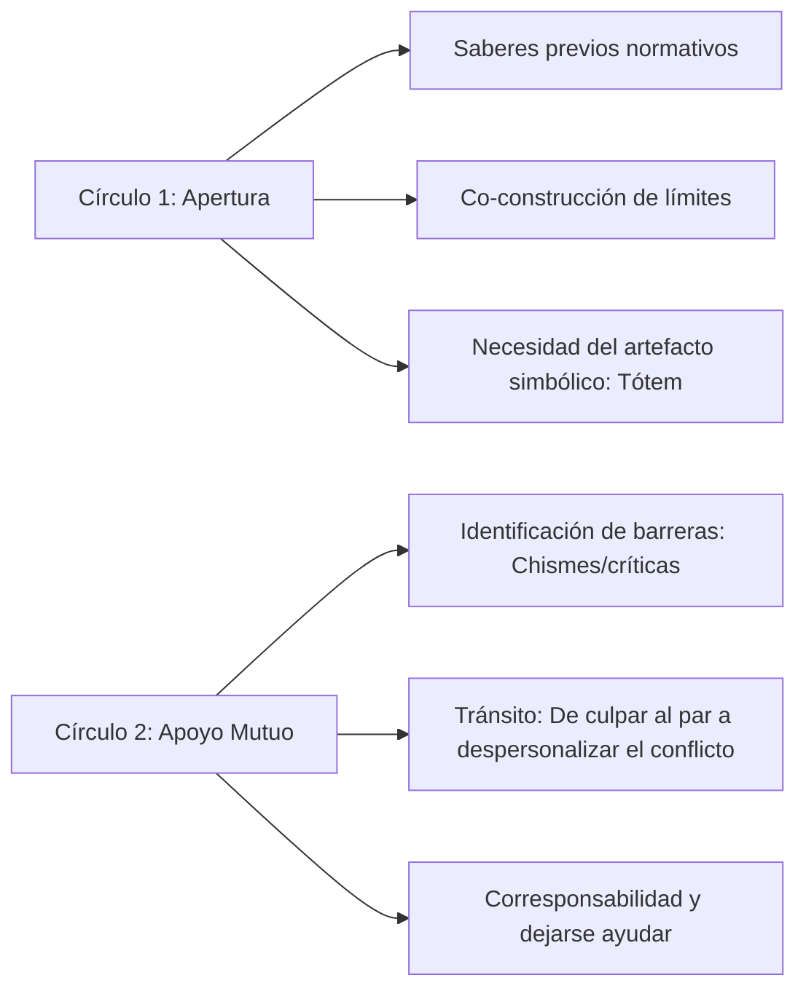

# 📊 Matriz de Análisis Cualitativo: Transcripciones Círculos de la Palabra (CP)

> **Documento de Referencia y Pista de Auditoría Metodológica**  
> **Fuente Original:** `ANÁLISIS CUALITATIVO TRANSCRIPCIONES CP.xlsx`  
> **Proyecto:** Círculos de la Palabra para el Clima Escolar, Convivencia y Apoyo Mutuo (Grado 701)  
> **Investigadoras / Facilitadoras:** Andrea Rojas & Zuliana Benavides  
> **Estado:** Sistematización y Codificación de los Círculos 1 (Apertura) y 2 (Apoyo Mutuo)

---

## 🧭 1. Marco Operativo y Criterios Metodológicos de Codificación

*Matriz basada en las pautas de codificación cualitativa (Saldaña, Braun & Clarke, Miles & Huberman):*

| Criterio Metodológico | Definición Operativa | Función en la Investigación |
| :--- | :--- | :--- |
| **Dato Bruto** | Registro textual u observacional original, directo y sin procesar obtenido en el campo (transcripción literal con marcas de tiempo). | Evidencia empírica primaria. |
| **In Vivo Coding** | Utiliza literalmente las palabras, giros o frases exactas manifestadas por los participantes (entre comillas). | Preserva la perspectiva *émica* y la voz de los estudiantes. |
| **Proceso (Gerundio)** | Verbo en gerundio que denota movimiento o interacción: 1. *Acciones físicas:* pintando, firmando, tomando la palabra. 2. *Procesos psicológicos y sociales:* despersonalizando la queja, negociando límites, acogiendo al excluido. | Rastrea la dinámica de cambio relacional. |
| **Método Afectivo** | Etiqueta las emociones explícitas (manifestadas abiertamente) o inferidas (deducidas del tono, postura o contexto) que viven los participantes. | Monitorea el clima socioafectivo del aula. |
| **Hallazgo (*Key Assertion*)**| Resultado sintético (*outcome*) de un proceso cíclico de codificación, categorización y reflexión analítica. | Respuestas a las preguntas orientadoras. |
| **Tema o Categoría** | Frase u oración explicativa extendida que identifica de qué trata un conjunto de datos y qué significa en profundidad. | Estructura conceptual del modelo. |

---

## ❓ 2. Preguntas Orientadoras por Eje Temático

| Eje Temático / Código Macro | Preguntas Orientadoras Utilizadas en los Círculos |
| :--- | :--- |
| **Clima escolar y gobernanza** | • ¿Saben qué es el clima escolar? • ¿Por qué es importante la necesidad seleccionada en la tarjeta? • ¿Qué me llevo de este primer círculo? |
| **Apoyo mutuo y despersonalización** | • ¿Qué necesito de mis compañeros para poder dar lo mejor de mí en este salón? • ¿Con cuál de los compromisos de apoyo mutuo que escribimos hoy te sientes más identificado para empezar a aplicar desde mañana? |
| **Práctica de cuidado y sensibilización** | *(Eje transversal en desarrollo para siguientes sesiones)* |
| **Respeto por la diversidad e inclusión** | *(Eje transversal en desarrollo para siguientes sesiones)* |
| **Trabajo colaborativo y sinergia** | *(Eje transversal en desarrollo para siguientes sesiones)* |

---

## 🏷️ 3. Libro de Códigos Cualitativos (*Codebook*)

*Estructura de Categorías, Categorías Emergentes y Definiciones del Proyecto:*

| Tema o Categoría | Categorías Emergentes | Definición y Significado Operativo |
| :--- | :--- | :--- |
| **Clima escolar** | **Gobernanza democrática** | Decisiones compartidas, colaboración horizontal, corresponsabilidad. |
| | **Descentralización de la autoridad** | Horizontalidad en el aula y alternancia de quién tiene la palabra en un momento específico. |
| | **Saberes previos** | Conocimiento y preconceptos con los que ya cuentan los estudiantes en relación al tema. |
| **Apoyo mutuo** | **Identificación y/o conflictos** | Observar desacuerdos, tensiones y metas de las partes involucradas. |
| | **Despersonalización del conflicto** | Enfocar el análisis en lo que se vive en el conflicto y en la conducta, más no en la persona que lo ocasiona. |
| | **Establecimiento de límites** | Definición explícita de pautas, fronteras y normas de comportamiento. |
| | **Generación de compromisos** | Acuerdos mutuos asumidos colectivamente. |
| **Empatía** | *(Transversal a todas las categorías)* | Reconocer sus propias emociones y, de igual manera, comprender las de sus compañeros. |
| **Práctica de cuidado** | **Redes de apoyo** | Relaciones interpersonales significativas con las cuales cuenta una persona. |
| | **Gestión emocional** | Comprender y regular lo que se siente de forma consciente. |
| **Respeto por la diversidad** | **Exclusión escolar** | Ignorar, rechazar o juzgar las diferencias individuales entre estudiantes. |
| **Trabajo colaborativo** | **Trabajo en equipo** | Esfuerzo colectivo para que el grupo funcione de forma coordinada (tipo engranaje). |
| | **Asignación de significados** | Mediación simbólica mediante objetos (ej. el Tótem como objeto de la palabra). |

---

## 📑 4. Matriz de Codificación: Círculo 1 (Apertura)

### Segmento 1.1: Conceptualización de Clima Escolar
* **Marca de Tiempo:** `00:11:31 – 00:11:49`
* **Dato Bruto:** Diálogo circular inicial sobre la definición de clima escolar.
* **Citas In Vivo:** 
  > E1: *"La convivencia"* | E2: *"Las normas"* | E3: *"El comportamiento de los estudiantes"* | E4: *"El respeto de los compañeros"* | D1: *"La forma en la que nosotros convivimos dentro del aula"*
* **Proceso (Gerundio):** Definiendo el clima en el aula.
* **Método Socio-Afectivo:** Valores de respeto y convivencia.
* **Códigos Asignados:** `COD-01: Convivencia`, `COD-02: Normas`, `COD-03: Comportamiento`, `COD-04: Entorno`, `COD-05: Respeto`, `COD-06: Forma de convivir`.
* **Tema / Categoría:** Clima Escolar.
* **Subcategorías Emergentes:** 1. Descentralización de la autoridad • 2. Saberes previos.
* **Análisis Interpretativo:** Los estudiantes definen colaborativamente lo que para ellos significa el clima escolar a través de valores como el respeto, las normas y la convivencia mediante un diálogo horizontal que da cuenta de sus conocimientos base.
* **Hallazgo (H1):** *Los estudiantes relacionan sus presaberes con el significado de clima escolar a nivel normativo y actitudinal.*

---

### Segmento 1.2: Tarjetas de Necesidades y Compromisos
* **Marca de Tiempo:** `00:28:20 – 00:34:41`
* **Dato Bruto:** Exposición grupal de compromisos a partir de tarjetas seleccionadas.
* **Citas In Vivo:** 
  > *"Celebrar cuando sea necesario"* • *"Ayudarnos"* • *"Gestionar las emociones"* • *"Animar a aquellos que estén tristes"* • *"No divulgar información de otros"* • *"Escoger nuestro propio camino"* • *"Respetar y reconocer los límites"* • *"Cuidarnos entre nosotros"* • *"Expresarnos adecuadamente"* • *"Objetivo de no decir groserías"* • *"Ser respetuosos, empáticos y considerados"* • *"Expresar ideas únicas y ser creativos"* • *"Escuchar al otro con respeto y respetar la palabra"*
* **Proceso (Gerundio):** Identificación de necesidades dentro del aula y establecimiento de compromisos.
* **Método Socio-Afectivo:** Valor: Reconocimiento y empatía.
* **Códigos Asignados:** `COD-07: Celebrar`, `COD-08: Ayudarnos`, `COD-09: Gestionar emociones`, `COD-10: Animar`, `COD-11: No divulgar información`, `COD-12: Reconocer límites`, `COD-13: Cuidarnos`, `COD-14: Expresarnos adecuadamente`, `COD-15: Empáticos`, `COD-16: Considerados`, `COD-17: Expresar ideas`, `COD-18: Creativos`, `COD-19: Escucha activa`.
* **Tema / Categoría:** Empatía.
* **Subcategorías Emergentes:** Establecimiento de límites y generación de compromisos.
* **Análisis Interpretativo:** Los estudiantes escogen qué necesidades son prioritarias para tener un buen ambiente en el aula, destacando la confidencialidad, el apoyo entre pares, el respeto por los límites y el reconocimiento del otro.
* **Hallazgo (H2):** *La autorregulación colectiva y el reconocimiento sustituyen a la norma impuesta mediante la co-construcción de compromisos.*

---

### Segmento 1.3: Construcción Simbólica del Tótem
* **Marca de Tiempo:** `00:37:57 – 00:38:23`
* **Dato Bruto:** Acuerdos sobre cómo pintar colectivamente el lienzo del Tótem.
* **Citas In Vivo:** 
  > F1: *"Nos vamos a tener que poner de acuerdo para pintar lienzo, por ejemplo, una huella"* • F2: *"Podríamos hacer un árbol y cada uno ponía su huella"* • F1: *"En cada grupo van a escoger algo que les guste y lo pintan en un recuadro del lienzo entre todos (...) este será nuestro tótem"*
* **Proceso (Gerundio):** Construcción del objeto de la palabra (Tótem).
* **Método Socio-Afectivo:** Emoción: Entusiasmo en la elaboración del tótem • Conflicto: Disputa por espacios físicos en el lienzo.
* **Códigos Asignados:** `COD-20: Creatividad`, `COD-21: Gustos`, `COD-22: Subjetividad`.
* **Tema / Categoría:** Trabajo colaborativo.
* **Subcategorías Emergentes:** Trabajo en equipo • Asignación de significados.
* **Análisis Interpretativo:** Al ser el primer círculo, la regla del Tótem se comprende a nivel cognitivo y discursivo (repiten que es importante respetar la palabra), pero en la práctica conductual cuesta mantener la autorregulación del silencio debido a la falta de costumbre en dinámicas horizontales y la ausencia del objeto físico mediador en este encuentro inicial.
* **Hallazgo (H3):** *Los estudiantes asimilan el valor de la escucha a nivel cognitivo, pero requieren la mediación de un artefacto tangible como el Tótem.*

---

## 📑 5. Matriz de Codificación: Círculo 2 (Apoyo Mutuo)

### Segmento 2.1: Identificación de Barreras Relacionales y Necesidades
* **Marca de Tiempo:** `00:08:16 – 00:11:47`
* **Citas In Vivo:** 
  > *"Que sean más amables"* • *"Que sean más compañeristas"* • *"Que tengan confianza"* • *"Que se dejen defender"* • *"Respeto"* • *"Que presten más atención"* • *"Comunicarnos mejor"* • *"No meternos en problemas"* • *"No cobrar cosas"* • *"Sentir de respetado"* • *"Explicarse mejor"* • *"Apoyarlos entre todos"* • *"Una convivencia sana con amabilidad"* • *"No meterse en chisme"*
* **Proceso (Gerundio):** Identificación de necesidades y/o conflictos.
* **Método Socio-Afectivo:** Valor: Sinceridad • Actitud: Conciencia de sí mismo.
* **Códigos Asignados:** `COD-02: Apoyo mutuo y despersonalización`.
* **Subcategorías Emergentes:** 1. Identificación y/o conflictos • 2. Despersonalización del conflicto.
* **Análisis Interpretativo:** Aunque inicialmente las necesidades son planteadas desde lo que esperan que cambie en los demás, el ejercicio favorece la comprensión de que las dificultades no deben atribuirse directamente a una persona, sino a comportamientos o dinámicas que pueden ser modificadas colectivamente.
* **Hallazgos Clave:**
  - **H1:** Los estudiantes reconocen necesidades relacionales para la convivencia (respeto, escucha, confianza, comunicación, amabilidad y compañerismo) como condiciones para sentirse bien en el aula.
  - **H2:** La crítica y los chismes aparecen como barreras comunicativas que dificultan la confianza y el apoyo mutuo.
  - **H3:** Se evidencia un tránsito desde la identificación del compañero como fuente del problema hacia el reconocimiento de conductas específicas, permitiendo abordar el conflicto sin culpabilizar directamente a una persona (*despersonalización del conflicto*).

---

### Segmento 2.2: Construcción de Acuerdos "Lo que necesitamos cambiar"
* **Marca de Tiempo:** `00:52:11 – 01:05:50`
* **Citas In Vivo:** 
  > *"No se paren a robar cuando el profesor explica"* • *"Para sentirme bien en el aula, necesito que mis compañeros dejen de criticar a los demás"* • *"Comprensión para mantener la convivencia, ser escuchado"* • *"Tener autonomía y pensar un futuro sin que los demás se critiquen"* • *"Ayudarnos mutuamente y dejarse ayudar"*
* **Proceso (Gerundio):** Construcción de acuerdos por grupos ("Lo que necesitamos cambiar").
* **Método Socio-Afectivo:** Valores: Respeto, apoyo mutuo • Emoción: Expresividad • Actitudes: Concentración, compañerismo.
* **Códigos Asignados:** `COD-02: Apoyo mutuo y despersonalización`.
* **Subcategorías Emergentes:** 1. Despersonalización del conflicto • 2. Establecimiento de límites • 3. Generación de compromisos.
* **Análisis Interpretativo:** Se evidencian rasgos de responsabilidad grupal y consensos en compromisos sobre aspectos que requieren transformarse en el aula.
* **Hallazgos Clave:**
  - **H5:** *Reconocimiento de barreras para el bienestar:* Identificación clara de conductas disruptivas y juicios entre pares.
  - **H6:** *Despersonalización del conflicto:* Paso de la queja personal hacia la construcción propositiva de normas de convivencia.
  - **H7:** *Consolidación de acuerdos:* Consensos en torno al respeto, la solidaridad y el compañerismo, asumiendo la corresponsabilidad de un ambiente seguro.

---

## 📈 6. Síntesis Comparativa de Hallazgos Transversales

1. **Evolución del Discurso:** En el Círculo 1 la norma se percibe como una regla exterior o aprendida cognitivamente; en el Círculo 2 los estudiantes la vinculan a su bienestar emocional y a la necesidad de no ser juzgados.
2. **El Concepto Potente de *Despersonalización del Conflicto*:** Es el hallazgo central del proyecto: los estudiantes aprenden a separar a la persona del comportamiento que genera daño, habilitando la reconciliación y el clima de aula seguro.
